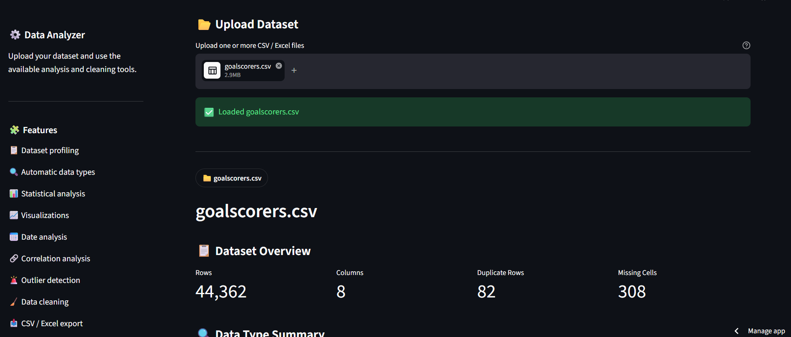
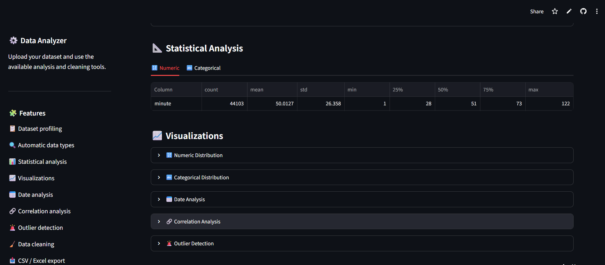
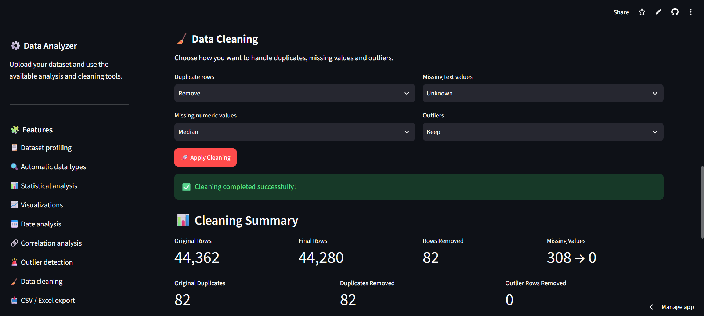

# Generic CSV & Excel Data Analyzer

> A Python-based web application for cleaning, profiling, analyzing, visualizing, and exporting CSV and Excel datasets.

### 🌐 Live Demo

**[Launch the Live Application](https://business-data-automation-gskkbqzkgxadfgznrjiy6k.streamlit.app/)**

### 📂 Source Code

**[View on GitHub](https://github.com/imaadmohd22/business-data-automation)**

---

## 📸 Application Preview

### Dataset Overview



### Data Analysis & Visualizations



### Data Cleaning



---

## 🚀 Features

### 📂 File Upload

* CSV file support
* Excel (`.xlsx`) file support
* Multiple file upload
* File validation and error handling

### 🔍 Automatic Data Profiling

The application automatically analyzes uploaded datasets and provides:

* Number of rows and columns
* Column names
* Data types
* Missing values
* Duplicate records
* Unique values
* Numeric columns
* Categorical columns
* Date columns

### 📊 Data Analysis

#### Numeric Analysis

* Count
* Mean
* Standard deviation
* Minimum and maximum
* Quartiles
* Statistical summaries
* Distribution visualization

#### Categorical Analysis

* Unique values
* Most frequent values
* Frequency distribution
* Category visualization

#### Date Analysis

* Minimum and maximum dates
* Date range
* Records by month
* Records by year

### 🔗 Correlation Analysis

The application calculates correlations between numeric columns and identifies strong relationships between variables.

> Correlation does not necessarily imply causation.

### 🚨 Outlier Detection

Uses the **Interquartile Range (IQR)** method to identify potential numeric outliers.

Users can:

* Detect outliers
* Keep outliers
* Remove outlier rows
* Cap extreme values

### 🧹 Data Cleaning

Users can configure cleaning operations for:

* Missing numeric values
* Missing text values
* Duplicate rows
* Numeric outliers

Available strategies include:

* Remove rows
* Keep missing values
* Replace with median
* Replace with mean
* Replace with most frequent value
* Replace missing text with `Unknown`
* Remove outlier rows
* Cap extreme values

### 📥 Export

Cleaned datasets can be downloaded as:

* CSV
* Excel (`.xlsx`)

---

## 🛠️ Tech Stack

| Technology | Purpose                      |
| ---------- | ---------------------------- |
| Python     | Application logic            |
| Pandas     | Data processing and analysis |
| Streamlit  | Interactive web application  |
| OpenPyXL   | Excel file processing        |

---

## 🏗️ Project Structure

```text
business-data-automation/
│
├── app.py
├── processor.py
├── requirements.txt
├── .gitignore
├── README.md
│
└── screenshots/
    ├── overview.png
    ├── analysis.png
    └── cleaning.png
```

### Main Files

**`app.py`**

Contains the Streamlit user interface, file upload workflow, visualizations, cleaning controls, and download functionality.

**`processor.py`**

Contains the reusable data-processing logic including:

* Data profiling
* Type detection
* Statistical analysis
* Date analysis
* Correlation analysis
* Outlier detection
* Data cleaning

---

## 🔄 Application Workflow

```text
CSV / Excel Upload
        ↓
File Detection
        ↓
Dataset Preview
        ↓
Automatic Data Profiling
        ↓
Data Quality Checks
        ↓
Data Cleaning
        ↓
Statistical Analysis
        ↓
Charts & Visualizations
        ↓
Export Cleaned Dataset
```

---

## 💻 Run Locally

### 1. Clone the repository

```bash
git clone https://github.com/imaadmohd22/business-data-automation.git
```

### 2. Navigate to the project

```bash
cd business-data-automation
```

### 3. Create a virtual environment

```bash
python -m venv venv
```

### 4. Activate the environment

Windows:

```bash
venv\Scripts\activate
```

### 5. Install dependencies

```bash
pip install -r requirements.txt
```

### 6. Start the application

```bash
streamlit run app.py
```

The application will open in your browser.

---

## 📌 Example Use Cases

The tool can be used for many types of tabular datasets, including:

* Business data
* Customer data
* Survey datasets
* Financial datasets
* Sports statistics
* Operational data
* Research datasets
* Marketing data
* General CSV/Excel files

The application does **not** depend on fixed domain-specific columns, allowing it to work with different types of datasets.

---

## 🎯 Project Objective

Many data workflows involve repetitive manual tasks such as:

1. Opening CSV/Excel files
2. Inspecting data
3. Checking missing values
4. Finding duplicates
5. Identifying data types
6. Detecting outliers
7. Calculating statistics
8. Creating visualizations
9. Cleaning the dataset
10. Exporting the processed file

This application combines these common tasks into a single interactive workflow.

---

## 🔮 Future Improvements

Potential future improvements include:

* PDF report generation
* Automated data-quality scoring
* Additional visualization options
* Advanced Excel support
* Multi-file comparison
* Intelligent column matching
* Automated cleaning recommendations
* User-defined cleaning pipelines
* Database connectivity
* Authentication
* AI-assisted data analysis

---

## 👨‍💻 Author

**Mohd Imaad**

Computer Science & Artificial Intelligence

* GitHub: [imaadmohd22](https://github.com/imaadmohd22)
* LinkedIn: [Mohd Imaad](https://www.linkedin.com/in/mohd-imaad-b40311257/)

---

## 📄 License

This project is currently available for portfolio and demonstration purposes.
